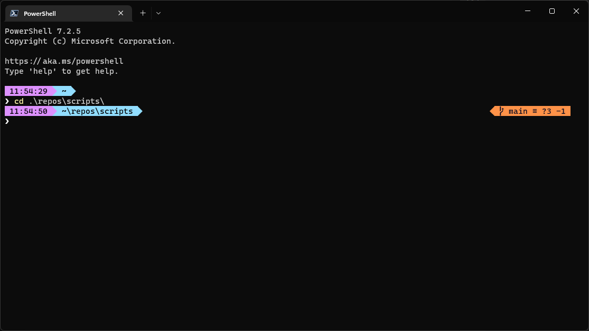

# Oh My Posh theme

## Font
Cascadia Code PL \
[GitHub - microsoft/cascadia-code](https://github.com/microsoft/cascadia-code)

## Oh My Posh
### Installation
`winget install JanDeDobbeleer.OhMyPosh`

### Links
[Website - ohmyposh.dev](https://ohmyposh.dev/) \
[GitHub - jandedobbeleer/oh-my-posh](https://github.com/jandedobbeleer/oh-my-posh) \
[Documentation - Customize](https://ohmyposh.dev/docs/installation/customize)